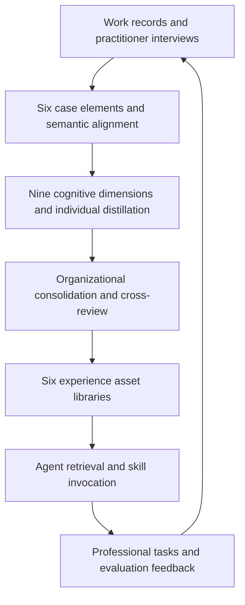
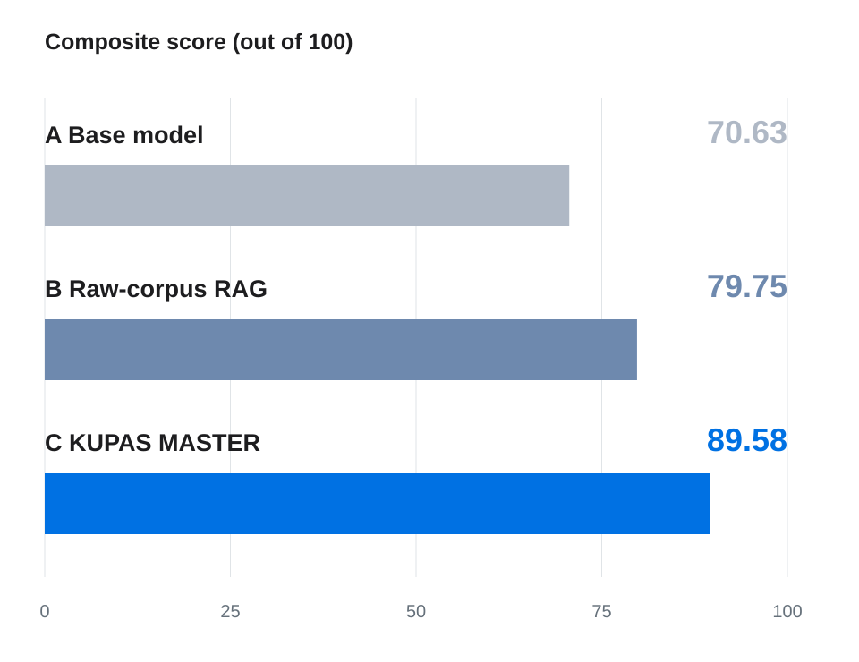

<div align="center">


<h1>KUPAS&nbsp;MASTER</h1>

**Experience Engineering for AI Agents**

**Human expertise. Agent-ready.**

Distilling tacit expertise into traceable, reusable experience corpora and callable agent skills.

[中文](README.md) · [English](README.en.md)

[](https://tongjiai4e.github.io/KUPAS-MASTER-Report/?lang=en)
[](#technical-reports)
[](https://github.com/TongjiAI4E/KUPAS-MASTER-Report/actions/workflows/pages.yml)

**[Project website](https://tongjiai4e.github.io/KUPAS-MASTER-Report/?lang=en) · [Try the product](https://lsf.kupasai.com/) · [English report](https://tongjiai4e.github.io/KUPAS-MASTER-Report/assets/reports/KUPAS-MASTER-Technical-Report-EN.pdf) · [中文报告](https://tongjiai4e.github.io/KUPAS-MASTER-Report/assets/reports/KUPAS-MASTER-Technical-Report-ZH.pdf)**

<p align="center">
  
</p>

</div>

**KUPAS MASTER (老师傅, also known as LaoShiFu)** is an experience engineering platform developed by Shanghai Kupas Technology Co., Ltd. and Tongji University. Its core method, **nine-layer cognitive corpus construction**, turns work records and practitioner interviews into traceable, reviewable, reusable experience corpora and callable skills for large language model (LLM) agents. It captures tacit knowledge, professional reasoning, action strategies, and conditions of use.

This repository publishes the technical reports, bilingual project website, evaluation figures, and aggregate chart data. Use the [product website](https://lsf.kupasai.com/) to access the platform. Platform backend code, model weights, and original business corpora are not included here.

[Overview](#overview) · [Nine dimensions](#nine-layer-cognitive-corpus-construction) · [Workflow](#seven-step-experience-engineering-workflow) · [Evaluation](#evaluation) · [Case study](#case-study-work-injury-dispute-mediation) · [Reports](#technical-reports) · [Local preview](#local-preview-and-maintenance) · [Citation](#citation)

## Overview

Professional expertise includes what to look for, why a judgment holds, how to act, and when a familiar approach no longer applies. KUPAS MASTER preserves this reasoning alongside source evidence, turning individual know-how into organizational knowledge and agent capabilities.

| Component | Contents | Purpose |
| --- | --- | --- |
| **Six case elements** | Context, cues, judgment, action, boundaries, outcomes | Preserve the context and process of a professional task |
| **Nine cognitive dimensions** | Knowledge, attention, judgment, decision, association, anticipation, monitoring, habits, constraints | Extract experience from facts, reasoning, actions, and feedback |
| **Six asset libraries** | Rules, constraints, best practices, negative examples, corner cases, skills | Make experience retrievable and skills callable |



The framework connects **source evidence, conditions of use, review status, and execution feedback**. Agents retrieve reviewed experience and invoke structured skills with explicit inputs, steps, dependencies, and stopping conditions.

## Nine-layer cognitive corpus construction

The nine layers are complementary extraction dimensions rather than a fixed execution sequence. A single experience may span multiple dimensions.

| Dimension | Key question | Experience representation |
| --- | --- | --- |
| L1 Knowledge | Which facts and concepts were used? | Entities, terms, relationships, attribute versions, and source anchors |
| L2 Attention | Which observations received attention? | Focus objects, inspection sequences, attention transitions, and evidence |
| L3 Judgment | What evidence supports this judgment? | Judgment rules, supporting and opposing evidence, conditions, and validity boundaries |
| L4 Decision | How is the next action selected? | Candidate actions, selection rationale, triggers, stopping and fallback conditions |
| L5 Association | Which other cases or concepts are relevant? | Analogies, bridging cues, and candidate links for verification |
| L6 Anticipation | What consequences are anticipated? | Expected outcomes, time horizons, and follow-up verification |
| L7 Monitoring | When is further evidence or review needed? | Knowledge gaps, items awaiting verification, and review conditions |
| L8 Habits | Which practices recur across cases? | Atomic operations, composite workflows, and optional communication templates |
| L9 Constraints | What is prohibited and what is required? | Prohibitions, required actions, authority boundaries, and review status |

Extracted candidates enter review with their source evidence and applicability conditions. See [Section 3 of the report](https://tongjiai4e.github.io/KUPAS-MASTER-Report/assets/reports/KUPAS-MASTER-Technical-Report-EN.pdf#page=6).

## Seven-step experience engineering workflow

1. **Define the task**: specify the role, task, goals, and decision boundaries.
2. **Collect evidence**: gather work records, interviews, and missing evidence.
3. **Align semantics**: align terms, entities, and events across sources.
4. **Distill experience**: extract individual candidate assets across nine dimensions.
5. **Consolidate assets**: combine common knowledge while retaining contextual differences and disagreements.
6. **Cross-review**: review evidence, applicability, and accuracy.
7. **Evaluate and refine**: assess task outputs and feed findings into collection and revision.

Reviewed asset snapshots support agent execution. Task outcomes and execution records inform subsequent refinement.

## Evaluation

The report compares three configurations on the same professional tasks under common scoring criteria: a base model, raw-corpus retrieval-augmented generation (RAG), and the KUPAS MASTER agent.

| Configuration | Method | Composite score / 100 |
| --- | --- | ---: |
| A | Base model | 70.63 |
| B | Raw-corpus RAG | 79.75 |
| **C** | **KUPAS MASTER agent** | **89.58** |

**KUPAS MASTER improves on raw-corpus RAG by 9.83 points.** It leads across all seven scoring dimensions, and all 20 practitioner groups follow the ordering C > B > A.



- **Seven dimensions**: result correctness, output actionability, depth of professional judgment, evidence sufficiency and accuracy, appropriate tool and skill use, understanding requirements, and boundaries and compliance.
- **Evidence and boundaries**: evidence sufficiency and accuracy improve by 11.1 points and boundaries and compliance by 9.0 points over raw-corpus RAG.
- **Professional coverage**: finance, governance, engineering, safety, healthcare, and mediation tasks.

The evaluation includes **20 practitioner groups, 177 questions, and 531 responses**, scored internally by an LLM and aggregated with equal weight per practitioner. The results describe the evaluated samples and the complete experience configuration. Source: [Sections 8–9 and Table 7](https://tongjiai4e.github.io/KUPAS-MASTER-Report/assets/reports/KUPAS-MASTER-Technical-Report-EN.pdf#page=20).

[Seven-dimension chart](website/dist/assets/results/dimensions-en.svg) · [Gains across 20 groups](website/dist/assets/results/practitioners-en.svg) · [Aggregate chart data (JSON)](website/dist/assets/results/results-data.json) · [Sources and metric definitions](website/SOURCES.md)

## Case study: work-injury dispute mediation

The report records a mediation task involving a traffic accident during a detour to pick up a child after work. The comparison uses **two interview sources and 167 experience assets**.

| Configuration | Behavior recorded in the report |
| --- | --- |
| Base model | Provides a general analytical framework and evidence checklist |
| Raw-corpus RAG | Retrieves regulatory provisions and proposes mediation steps with some procedural and risk guidance |
| KUPAS MASTER | Invokes a mediation request assessment and focusing skill, combines rules with corner cases, distinguishes authority boundaries, and produces a structured result file |

The case illustrates how experience assets contribute to evidence verification, issue framing, and a structured workflow. See [Section 7.1](https://tongjiai4e.github.io/KUPAS-MASTER-Report/assets/reports/KUPAS-MASTER-Technical-Report-EN.pdf#page=18).

## Technical reports

| Language | Report | Length |
| --- | --- | --- |
| English | [KUPAS MASTER: Distilling the Tacit Expertise of Master Practitioners into Agent-Ready Experience Corpora](https://tongjiai4e.github.io/KUPAS-MASTER-Report/assets/reports/KUPAS-MASTER-Technical-Report-EN.pdf) | 38 pages |
| 中文 | [老师傅：将资深从业者的隐性经验蒸馏为面向智能体的经验语料](https://tongjiai4e.github.io/KUPAS-MASTER-Report/assets/reports/KUPAS-MASTER-Technical-Report-ZH.pdf) | 38 页 |

The reports cover structured representation, cognitive extraction pipelines, organizational consolidation, skill construction, evaluation, and deployment. Edition: September 2026. Author: **KUPAS MASTER Team**. Institutions: **Shanghai Kupas Technology Co., Ltd. and Tongji University**.

## Product and deployment

The platform supports cloud use and customized local deployment. Local models and intranet tools can keep processing within a customer's infrastructure, supported by authentication, access controls, and audit records.

- **Use the platform**: [lsf.kupasai.com](https://lsf.kupasai.com/).
- **Explore the project website**: [GitHub Pages](https://tongjiai4e.github.io/KUPAS-MASTER-Report/?lang=en).
- **Host this report website**: static HTML, CSS, and JavaScript, with no backend, CDN, or external font dependencies. [GitHub Actions](.github/workflows/pages.yml) deploys `website/dist/`.

## Frequently asked questions

**How does KUPAS MASTER differ from raw-corpus RAG?**

The RAG baseline retrieves original source material. KUPAS MASTER first transforms the same source material into reviewed experience assets, then lets agents retrieve experience and invoke skills while preserving reasoning and action boundaries.

**Does experience distillation mean model parameter distillation?**

Here, it means organizing practitioner expertise into experience corpora, rules, and skills. This repository publishes reports and presentation materials; it does not distribute model weights.

**Can I run the complete platform from this repository?**

You can run the report website directly. Visit the [product website](https://lsf.kupasai.com/) for platform access and local deployment information.

## Local preview and maintenance

```bash
git clone https://github.com/TongjiAI4E/KUPAS-MASTER-Report.git
cd KUPAS-MASTER-Report
python -m http.server 4173 --bind 127.0.0.1 --directory website/dist
```

Open [http://127.0.0.1:4173/](http://127.0.0.1:4173/). Use `?lang=zh` or `?lang=en` to select a language, or open `website/dist/index.html` directly.

| Path | Contents |
| --- | --- |
| [`website/dist/`](website/dist/) | Deployable bilingual static website |
| [`website/dist/assets/reports/`](website/dist/assets/reports/) | Complete PDF reports |
| [`website/dist/assets/results/`](website/dist/assets/results/) | Bilingual figures, original report figures, and aggregate data |
| [`website/scripts/build-results.cjs`](website/scripts/build-results.cjs) | Rebuild bilingual SVG charts from the aggregate data |
| [`website/scripts/verify.cjs`](website/scripts/verify.cjs) | Browser, responsive layout, and PDF download verification |
| [`website/SOURCES.md`](website/SOURCES.md) | Content provenance and statistical definitions |
| [`website/MAINTENANCE.md`](website/MAINTENANCE.md) | Website maintenance, verification, and deployment notes |

Report errors, translation suggestions, and website issues through [Issues](https://github.com/TongjiAI4E/KUPAS-MASTER-Report/issues) or a pull request. For numerical corrections, include the report page, table, or figure number.

## Citation

```bibtex
@techreport{kupasmaster2026,
  title       = {{KUPAS MASTER}: Distilling the Tacit Expertise of Master Practitioners into Agent-Ready Experience Corpora},
  author      = {{KUPAS MASTER Team}},
  institution = {Shanghai Kupas Technology Co., Ltd. and Tongji University},
  year        = {2026},
  month       = {9},
  url         = {https://tongjiai4e.github.io/KUPAS-MASTER-Report/}
}
```

Machine-readable citation metadata is available in [`CITATION.cff`](CITATION.cff).

**Research topics**: experience engineering, tacit knowledge, expert expertise, knowledge acquisition, experience corpora, organizational knowledge, LLM agents, agent skills, retrieval-augmented generation, and AI for engineering.
