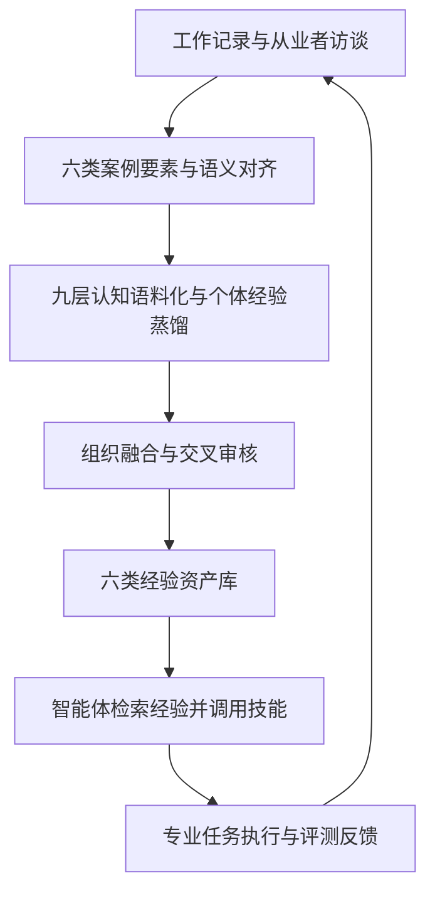
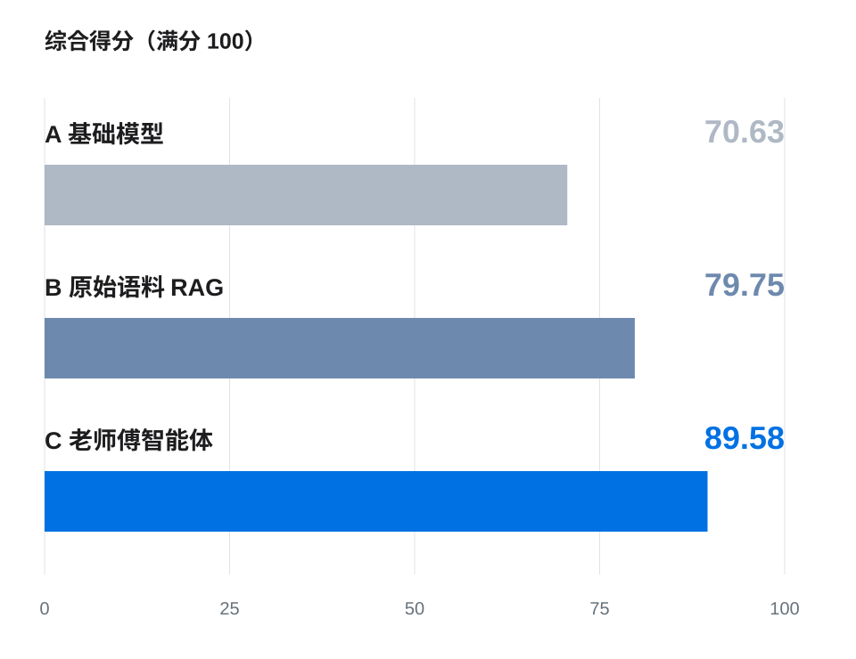

<div align="center">

<h1>老师傅 KUPAS&nbsp;MASTER</h1>

**面向 AI 智能体的经验工程**

**让隐性经验成为智能体的能力。**

**Experience engineering for AI agents — from tacit expertise to traceable experience corpora and callable skills.**

[中文](README.md) · [English](README.en.md)

[](https://tongjiai4e.github.io/KUPAS-MASTER-Report/)
[](#技术报告)
[](https://github.com/TongjiAI4E/KUPAS-MASTER-Report/actions/workflows/pages.yml)

**[项目主页](https://tongjiai4e.github.io/KUPAS-MASTER-Report/) · [产品体验](https://lsf.kupasai.com/) · [中文报告](https://tongjiai4e.github.io/KUPAS-MASTER-Report/assets/reports/KUPAS-MASTER-Technical-Report-ZH.pdf) · [English Report](https://tongjiai4e.github.io/KUPAS-MASTER-Report/assets/reports/KUPAS-MASTER-Technical-Report-EN.pdf)**

<p align="center">
  
</p>

<p align="center">
  
  &nbsp;
  
</p>

</div>

**老师傅（KUPAS MASTER，也称 LaoShiFu）** 是上海库帕思科技有限公司与同济大学联合开展的经验工程平台。平台以**九层认知语料化**为核心，将工作记录与从业者访谈中的隐性知识、专业判断、行动策略和适用边界，转化为可追溯、可审核、可复用的经验语料与可调用技能，支撑大语言模型（LLM）智能体执行专业任务。

本仓库发布技术报告、双语项目主页、评测图表及其汇总数据。平台体验请访问[老师傅官网](https://lsf.kupasai.com/)；本仓库不包含平台后端、模型权重或原始业务语料。

[平台概览](#平台概览) · [九层技术](#九层认知语料化) · [经验工程流程](#七步经验工程流程) · [效果评测](#效果评测) · [运行案例](#运行案例工伤纠纷调解) · [技术报告](#技术报告) · [本地预览](#本地预览与维护) · [引用](#引用)

## 平台概览

专业经验不仅是“知道什么”，还包括关注什么、为什么这样判断、如何采取行动，以及何时不再适用。老师傅平台将这些判断依据与来源证据一起保留，让个人经验进入组织知识体系与智能体的任务执行过程。

| 组成 | 内容 | 作用 |
| --- | --- | --- |
| **六类案例要素** | 情境、线索、判断、行动、边界、结果 | 保留专业任务的上下文与处理过程 |
| **九个认知维度** | 知识、注意、判断、决策、联想、预判、监控、习惯、约束 | 从事实、推理、行动与反馈中提炼隐性经验 |
| **六类经验资产库** | 规则、约束、最佳实践、负样本、非常规情形（边界案例）、技能 | 形成可检索的经验资产与可调用技能 |



框架将**来源证据、适用条件、审核状态与执行反馈**连接起来。智能体不仅可以检索经验，还可以调用具有明确输入、步骤、依赖及停止条件的结构化技能。

## 九层认知语料化

九层认知语料化（nine-layer cognitive corpus construction）从九个相互协作的维度提炼经验，同一条经验可以涉及多个维度，各层不是固定执行顺序。

| 维度 | 核心问题 | 经验表示 |
| --- | --- | --- |
| L1 知识 Knowledge | 用到了哪些事实与概念？ | 实体、术语、关系、属性版本与来源锚点 |
| L2 注意 Attention | 优先关注了哪些观察信息？ | 关注对象、检查顺序、注意转移及证据 |
| L3 判断 Judgment | 什么依据支持这一判断？ | 判断规则、正反证据、适用条件与失效边界 |
| L4 决策 Decision | 如何选择下一步行动？ | 候选动作、选择依据、触发、终止与回退条件 |
| L5 联想 Association | 哪些案例或概念与当前问题相关？ | 类比关系、桥接线索与待核验关联 |
| L6 预判 Anticipation | 预期会出现什么后果？ | 预期结果、时间范围与后续核实记录 |
| L7 监控 Monitoring | 何时需要补充证据或重新检查？ | 知识缺口、待核验事项与复核条件 |
| L8 习惯 Habits | 哪些流程在不同案例中反复出现？ | 原子操作、复合流程与可选话术 |
| L9 约束 Constraints | 哪些事情不能做，哪些必须做？ | 禁止事项、必须动作、责任边界与审核状态 |

抽取结果作为候选经验进入审核，保留原始证据和适用范围。完整方法见[报告第 3 节](https://tongjiai4e.github.io/KUPAS-MASTER-Report/assets/reports/KUPAS-MASTER-Technical-Report-ZH.pdf#page=6)。

## 七步经验工程流程

1. **场景定义**：明确角色、任务、目标与决策边界。
2. **数据归集**：汇集工作记录、访谈与补充证据。
3. **语义对齐**：对齐跨来源的术语、实体与事件。
4. **个体蒸馏**：以九层技术提炼个人候选经验资产。
5. **组织融合**：归并共性，保留情境差异与分歧。
6. **交叉审核**：检查证据依据、适用条件与表达准确性。
7. **评测反馈**：评价任务质量，反馈补充采集与资产修订。

通过已审核的资产快照支撑智能体执行，再以任务结果与运行记录推动经验持续修订。

## 效果评测

在相同专业任务和统一评分标准下，对比基础模型、原始语料检索增强生成（RAG）与老师傅智能体三种配置。

| 配置 | 方法 | 综合得分（满分 100） |
| --- | --- | ---: |
| A | 基础模型 Base model | 70.63 |
| B | 原始语料 RAG Raw-corpus RAG | 79.75 |
| **C** | **老师傅智能体 KUPAS MASTER** | **89.58** |

**老师傅相较原始语料 RAG 提高 9.83 分。** 七个评分维度均领先，20 个从业者评测组均呈现 C > B > A 的排序。



- **七维度质量**：结果正确性、成果可操作性、专业判断深度、依据充分性与准确性、工具与技能运用、需求理解、边界与合规。
- **证据与边界**：相较原始语料 RAG，依据充分性与准确性提高 11.1 分，边界与合规性提高 9.0 分。
- **专业任务覆盖**：金融财务、基层治理、工程、安全、医疗与调解等领域。

评测包含 **20 个从业者组、177 道题、531 个回答**，采用内部 LLM 评分，按从业者等权汇总。结果对应报告中的受控评测样本及整体经验配置。来源：[报告第 8–9 节与表 7](https://tongjiai4e.github.io/KUPAS-MASTER-Report/assets/reports/KUPAS-MASTER-Technical-Report-ZH.pdf#page=20)。

[七维均分图](website/dist/assets/results/dimensions-zh.svg) · [20 组得分增量图](website/dist/assets/results/practitioners-zh.svg) · [图表汇总数据 JSON](website/dist/assets/results/results-data.json) · [来源与统计口径](website/SOURCES.md)

## 运行案例：工伤纠纷调解

报告记录了一个“下班途中绕路接孩子发生交通事故”的调解任务，以 **2 份访谈语料、167 条经验资产**支撑三种配置的对比。

| 配置 | 报告记录的任务表现 |
| --- | --- |
| 基础模型 | 给出一般性分析框架与证据清单 |
| 原始语料 RAG | 引用相关法规条款，提出调解步骤及部分程序与风险提示 |
| 老师傅智能体 | 调用“调解请求判断与聚焦技能”，结合规则库与非常规情形库，区分权限边界，生成结构化结果文件 |

这个案例展示了经验资产如何进入证据核实、争议聚焦与处理流程。详见[报告第 7.1 节](https://tongjiai4e.github.io/KUPAS-MASTER-Report/assets/reports/KUPAS-MASTER-Technical-Report-ZH.pdf#page=18)。

## 技术报告

| 语言 | 报告 | 篇幅 |
| --- | --- | --- |
| 中文 | [老师傅：将资深从业者的隐性经验蒸馏为面向智能体的经验语料](https://tongjiai4e.github.io/KUPAS-MASTER-Report/assets/reports/KUPAS-MASTER-Technical-Report-ZH.pdf) | 38 页 |
| English | [KUPAS MASTER: Distilling the Tacit Expertise of Master Practitioners into Agent-Ready Experience Corpora](https://tongjiai4e.github.io/KUPAS-MASTER-Report/assets/reports/KUPAS-MASTER-Technical-Report-EN.pdf) | 38 pages |

报告涵盖结构化表示、认知抽取管线、组织融合、技能构建、任务评测及部署方案。报告版本：2026 年 9 月；团队：**KUPAS MASTER Team**；机构：**上海库帕思科技有限公司与同济大学**。

## 产品与部署

老师傅平台支持云端使用与定制化本地部署。对于敏感业务场景，可结合本地模型和内网工具，将数据处理限定在客户环境内，并配置身份认证、分级授权和操作审计。

- **使用老师傅平台**：[lsf.kupasai.com](https://lsf.kupasai.com/)。
- **阅读双语项目主页**：[GitHub Pages](https://tongjiai4e.github.io/KUPAS-MASTER-Report/)。
- **部署本仓库的报告网站**：静态 HTML、CSS 与 JavaScript，无后端、CDN 或外部字体依赖；由 [GitHub Actions](.github/workflows/pages.yml) 发布 `website/dist/`。

## 常见问题

**老师傅与原始语料 RAG 的区别是什么？**

RAG 基线检索原始资料；老师傅先把同源资料转化为经审核的结构化经验资产，再让智能体检索经验、调用技能，并保留判断依据和行动边界。

**“经验蒸馏”是否指模型参数蒸馏？**

这里指将从业者经验整理成经验语料、规则和技能的过程。本仓库发布的是技术报告与展示材料，不提供可下载模型权重。

**能否从本仓库直接运行完整老师傅平台？**

本仓库可以直接运行报告网站。完整产品的访问与本地部署需求请通过[平台官网](https://lsf.kupasai.com/)了解。

## 本地预览与维护

```bash
git clone https://github.com/TongjiAI4E/KUPAS-MASTER-Report.git
cd KUPAS-MASTER-Report
python -m http.server 4173 --bind 127.0.0.1 --directory website/dist
```

打开 [http://127.0.0.1:4173/](http://127.0.0.1:4173/)，使用 `?lang=zh` 或 `?lang=en` 选择语言。也可直接打开 `website/dist/index.html`。

| 路径 | 内容 |
| --- | --- |
| [`website/dist/`](website/dist/) | 可直接部署的双语静态主页 |
| [`website/dist/assets/reports/`](website/dist/assets/reports/) | 两份完整技术报告 PDF |
| [`website/dist/assets/results/`](website/dist/assets/results/) | 双语图表、报告原图及汇总数值 |
| [`website/scripts/build-results.cjs`](website/scripts/build-results.cjs) | 从汇总数据重建双语 SVG 图表 |
| [`website/scripts/verify.cjs`](website/scripts/verify.cjs) | 浏览器交互、响应式布局与 PDF 下载验证 |
| [`website/SOURCES.md`](website/SOURCES.md) | 内容来源和统计口径 |
| [`website/MAINTENANCE.md`](website/MAINTENANCE.md) | 网站维护、验证与部署说明 |

报告勘误、翻译和网页问题可提交 [Issue](https://github.com/TongjiAI4E/KUPAS-MASTER-Report/issues) 或 Pull Request；涉及实验数字时，请注明报告页码、表格或图号。

## 引用

```bibtex
@techreport{kupasmaster2026,
  title       = {{KUPAS MASTER}: Distilling the Tacit Expertise of Master Practitioners into Agent-Ready Experience Corpora},
  author      = {{KUPAS MASTER Team}},
  institution = {Shanghai Kupas Technology Co., Ltd. and Tongji University},
  year        = {2026},
  month       = {9},
  url         = {https://tongjiai4e.github.io/KUPAS-MASTER-Report/}
}
```

机器可读引用信息见 [`CITATION.cff`](CITATION.cff)。

**相关研究主题 / Research topics**：经验工程（experience engineering）、隐性知识（tacit knowledge）、专家经验（expert expertise）、知识获取（knowledge acquisition）、经验语料（experience corpora）、组织知识（organizational knowledge）、大语言模型智能体（LLM agents）、智能体技能（agent skills）、检索增强生成（retrieval-augmented generation）、工程智能（AI for engineering）。
